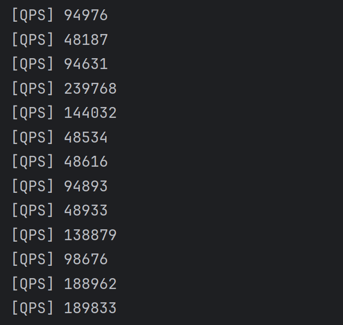

# 游戏服务器框架 网关gameServer
    JDK21
    apache-maven-3.9.5
    脚本工具:protoc-28.2-win64  https://github.com/protocolbuffers/protobuf/releases

## 启动方式 
    clone GameGatewayServer，GameServer，GameCommon项目
    先在protobufFilem目录下执行脚本toJava.bat,然后对所有模块maven进行clean，install成功即可
    nacos:docker版本：nacos/nacos-server:latest
# 项目：
# [GameCommon](GameCommon)
    公共模块:https://github.com/GDM-SuperDaHuang/GameCommon.git，protobuf文件，以及工具类的开发摘要 公共模块，protobuf文件，以及工具类的开发
# [GameGatewayServer](GameGatewayServer)
	网关服:https://github.com/GDM-SuperDaHuang/GameServer.git，路由，转发，负载均衡配置。
# [GameServer](GameServer)
	业务服:https://github.com/GDM-SuperDaHuang/GameServer.git，内置一场调用，进行具体业务等。

# 模块：
# [entrance](entrance)
    主启动类，程序入口
# [gateway](gateway)
    网关服，开发待续....

# QPS轻松突破4W+，最高可达24w+
# 
